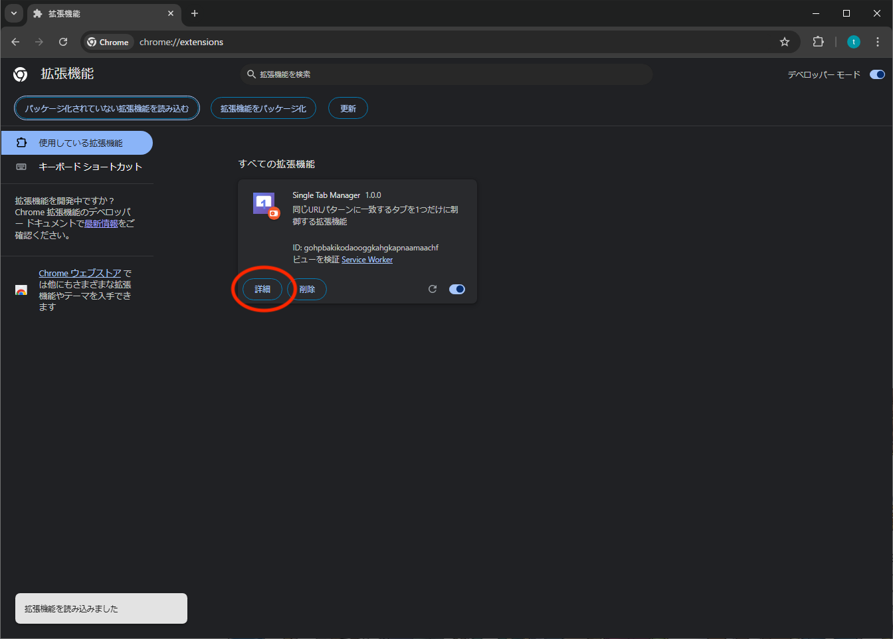
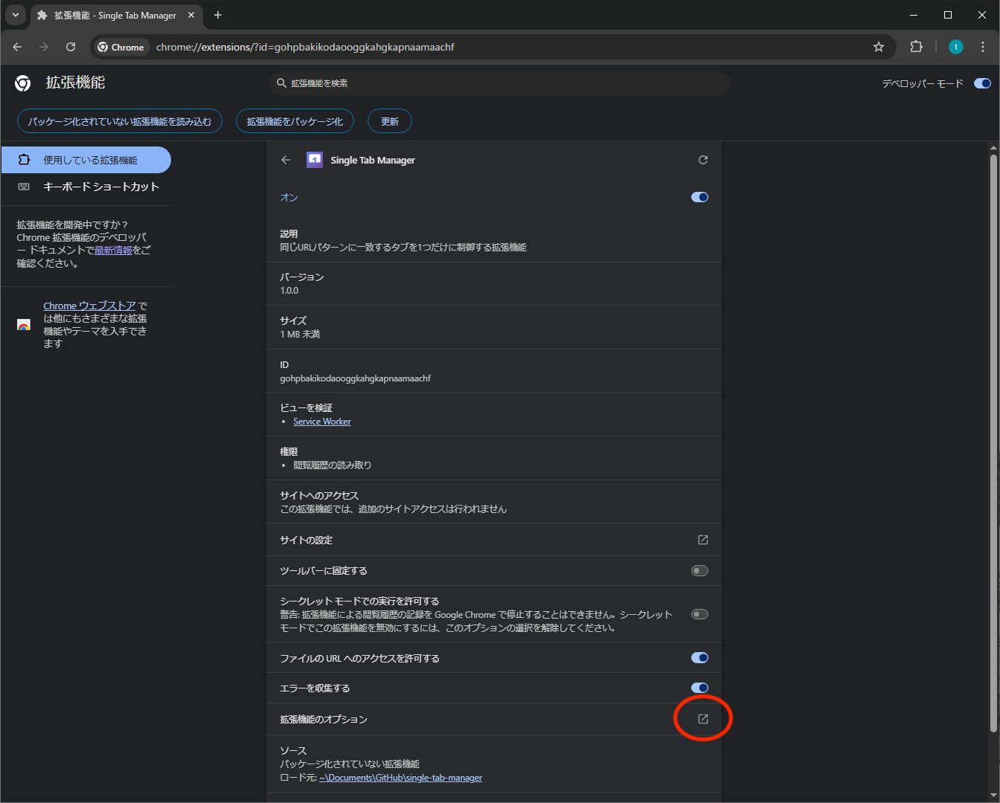
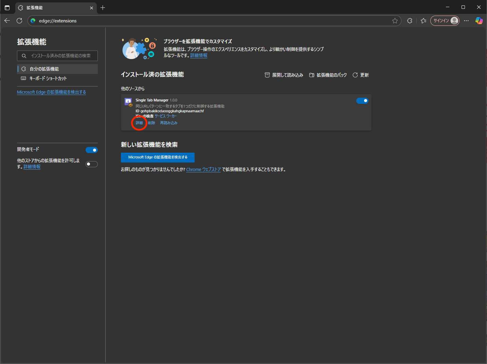
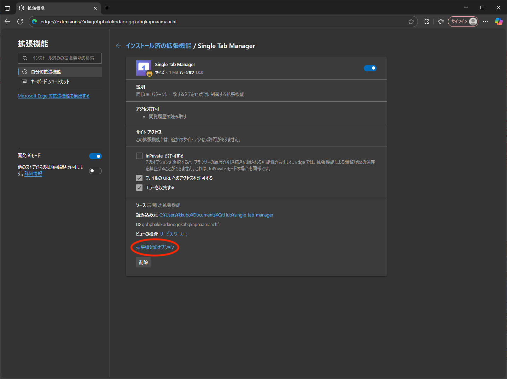
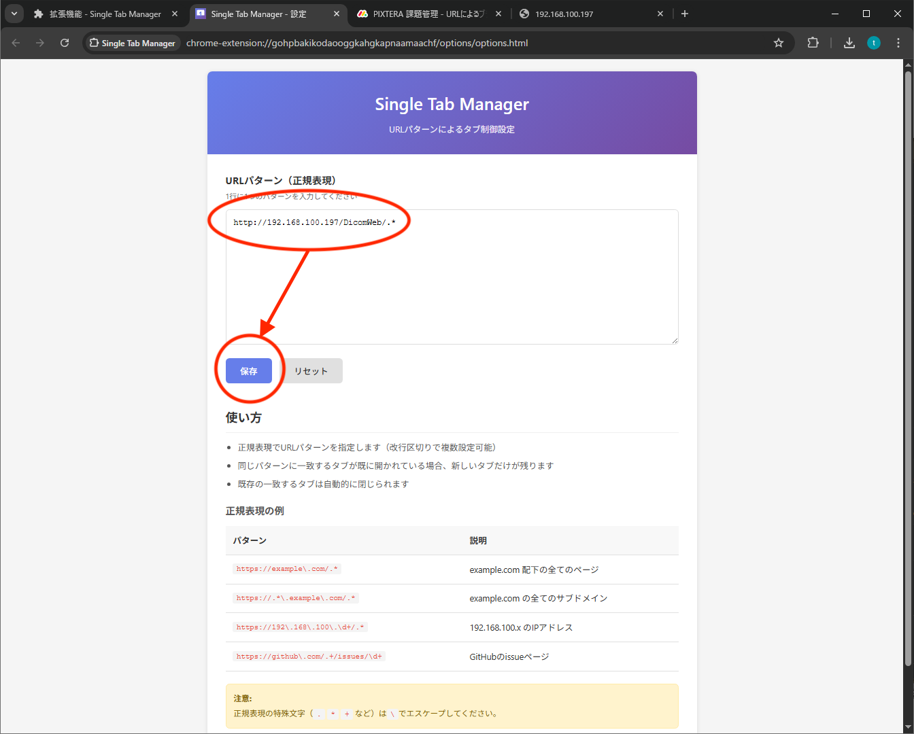
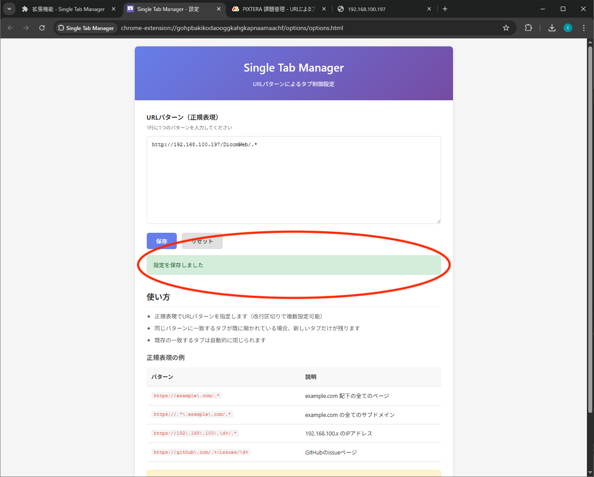

# Single Tab Manager インストール & 設定ガイド

このドキュメントでは、**Google Chrome** または **Microsoft Edge** に「Single Tab Manager」をインストールし、URL パターンを設定する方法を説明します。

---

## 1. 拡張機能をインストールする

### Chrome の場合

以下のリンクを開いて、「Chrome に追加」ボタンをクリックします：

https://chromewebstore.google.com/detail/single-tab-manager/ebjpibdekbeokpkbabiombofcadmkdmb?authuser=0&hl=ja

### Edge の場合

以下のリンクを開いて、「インストール」ボタンをクリックします：

https://microsoftedge.microsoft.com/addons/detail/single-tab-manager/hophlcdonmafhboablnkdfknpccfngpa

---

## 2. 設定画面を開く

拡張機能のオプションを開く方法:

### Chrome の場合

1. `chrome://extensions/` をアドレスバーに入力して開く
2. 「Single Tab Manager」の **詳細** ボタンをクリック
   
3. 「拡張機能のオプション」をクリック
   

### Edge の場合

1. `edge://extensions/` をアドレスバーに入力して開く
2. 「Single Tab Manager」の **詳細** ボタンをクリック
   
3. 「拡張機能のオプション」をクリック
   

---

## 3. URL パターンを設定する

1. 設定画面が開いたら、「URL パターン（正規表現）」の入力欄に対象 URL のパターンを入力します。

   例:

   ```
   http://192.168.100.197/DicomWeb/.*
   ```

2. **保存** ボタンをクリックします。

   

3. 画面に **「設定を保存しました」** と表示されれば完了です。

   

---

## 完了 🎉

これで「Single Tab Manager」が有効になり、指定した URL を複数開いた場合も常に最新の 1 タブだけが残るようになります。
