# Single Tab Manager インストール & 設定ガイド

このドキュメントでは、**Google Chrome** または **Microsoft Edge** に「Single Tab Manager」をインストールし、URL パターンを設定する方法を説明します。

---

## 1. 拡張機能の管理画面を開く

- **Chrome の場合**
  アドレスバーに次を入力して Enter を押します：

  ```
  chrome://extensions/
  ```

  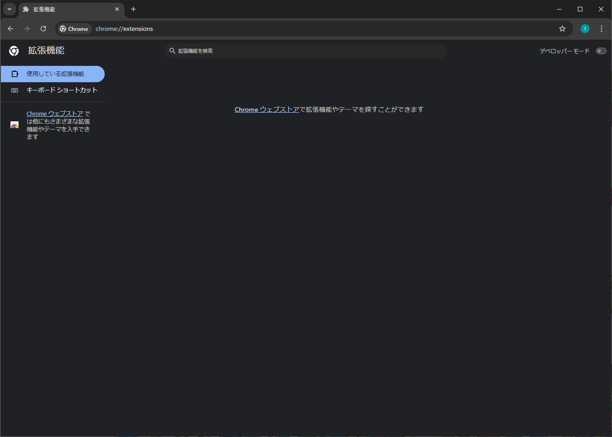

- **Edge の場合**
  アドレスバーに次を入力して Enter を押します：

  ```
  edge://extensions/
  ```

  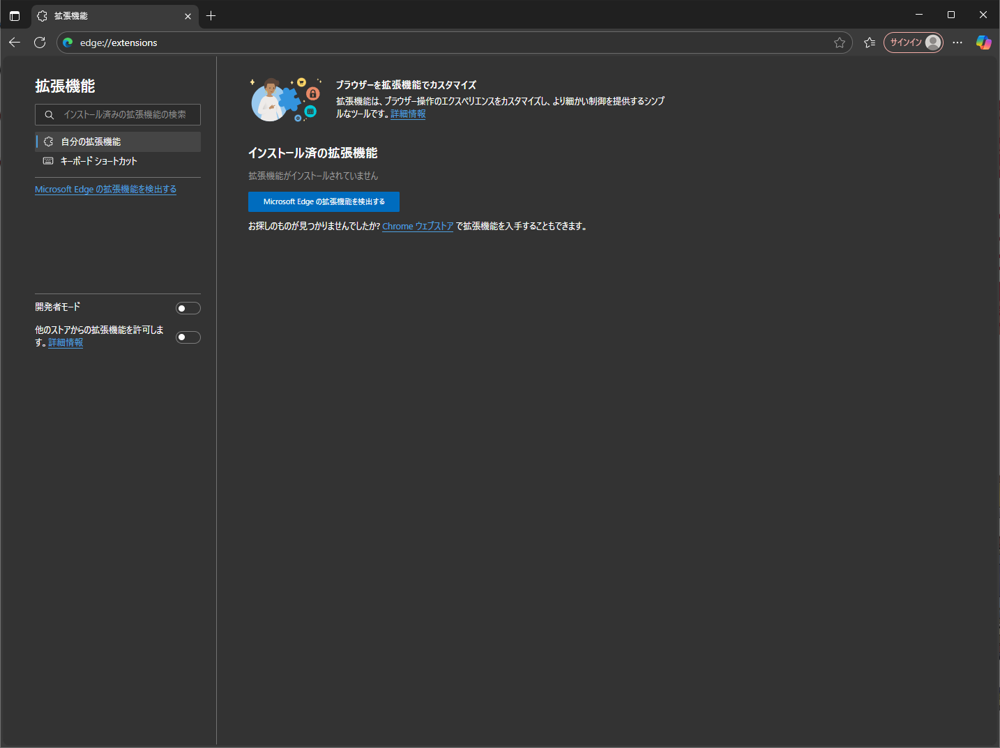

---

## 2. デベロッパーモードを有効化する

- **Chrome の場合**：「右上のスイッチ」をクリックして **デベロッパーモード** を ON にします。
  

- **Edge の場合**：「左下のスイッチ」をクリックして **開発者モード** を ON にします。
  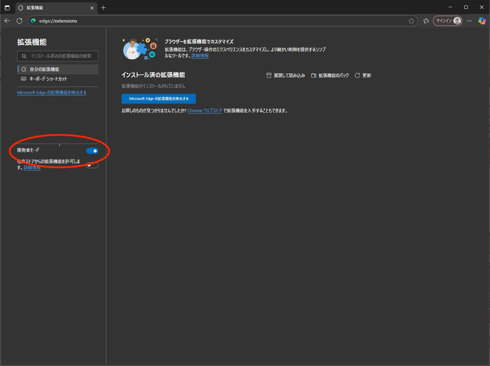

---

## 3. 拡張機能を読み込む

- **Chrome の場合**：「パッケージ化されていない拡張機能を読み込む」をクリック
  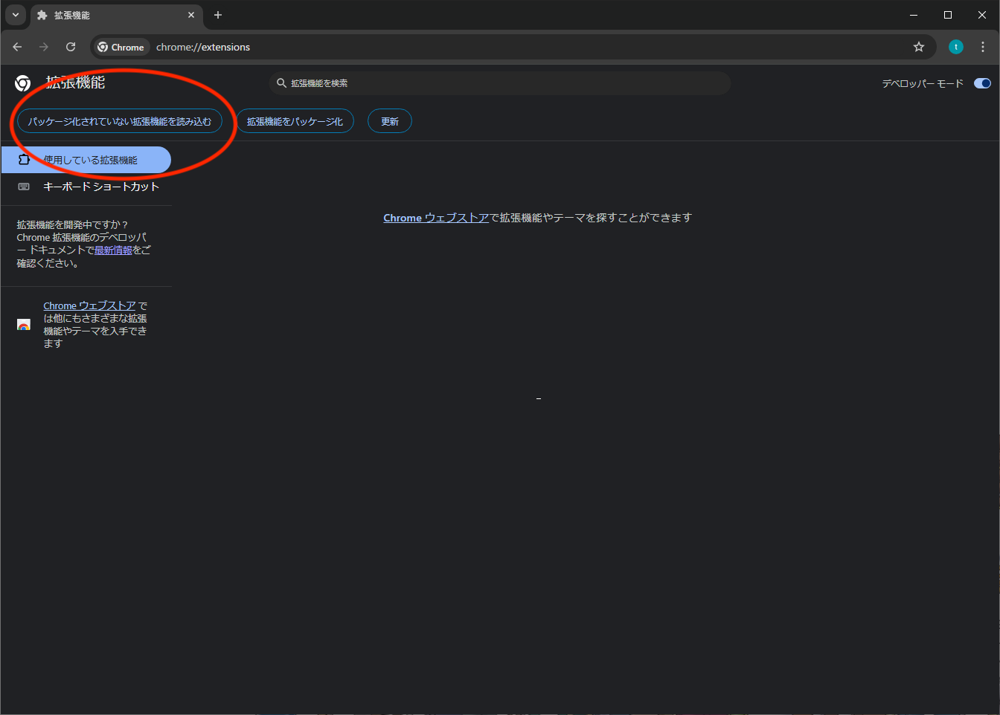

- **Edge の場合**：「展開して読み込み」をクリック
  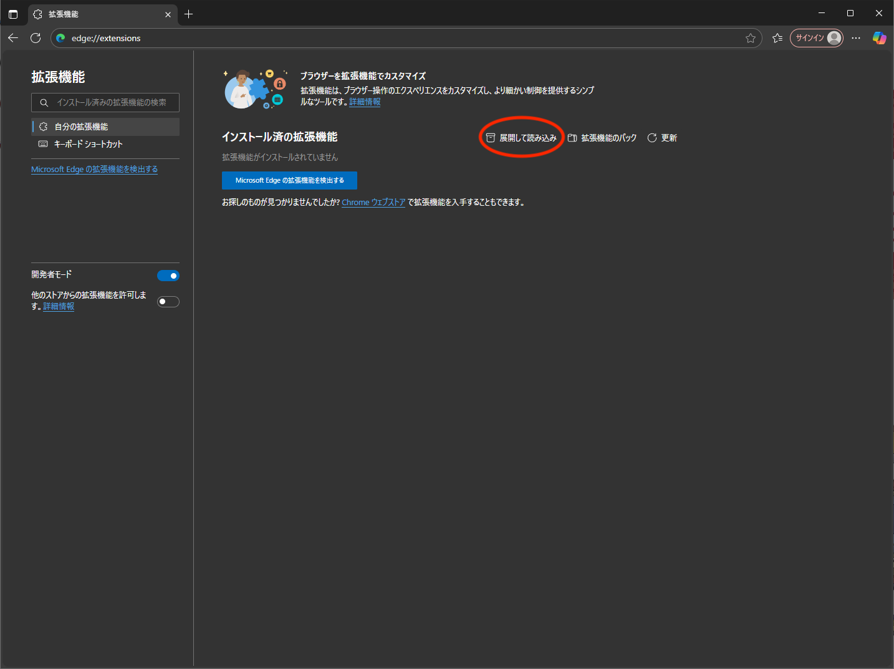

---

## 4. 拡張機能フォルダを選択

- **`single-tab-manager`** を選択して読み込みます。
  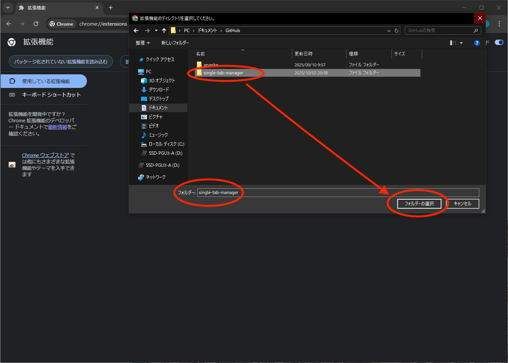

---

## 5. インストール確認

- 拡張機能一覧に **「Single Tab Manager」** が表示されていることを確認します。
  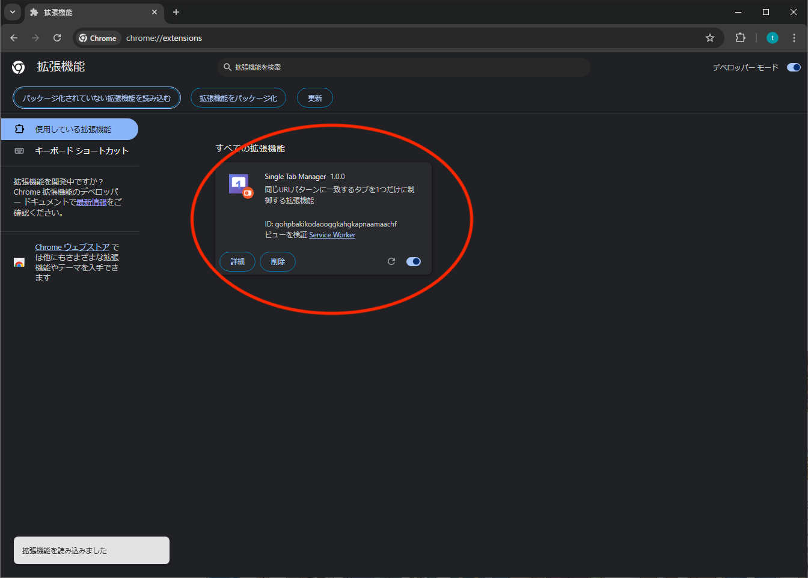
  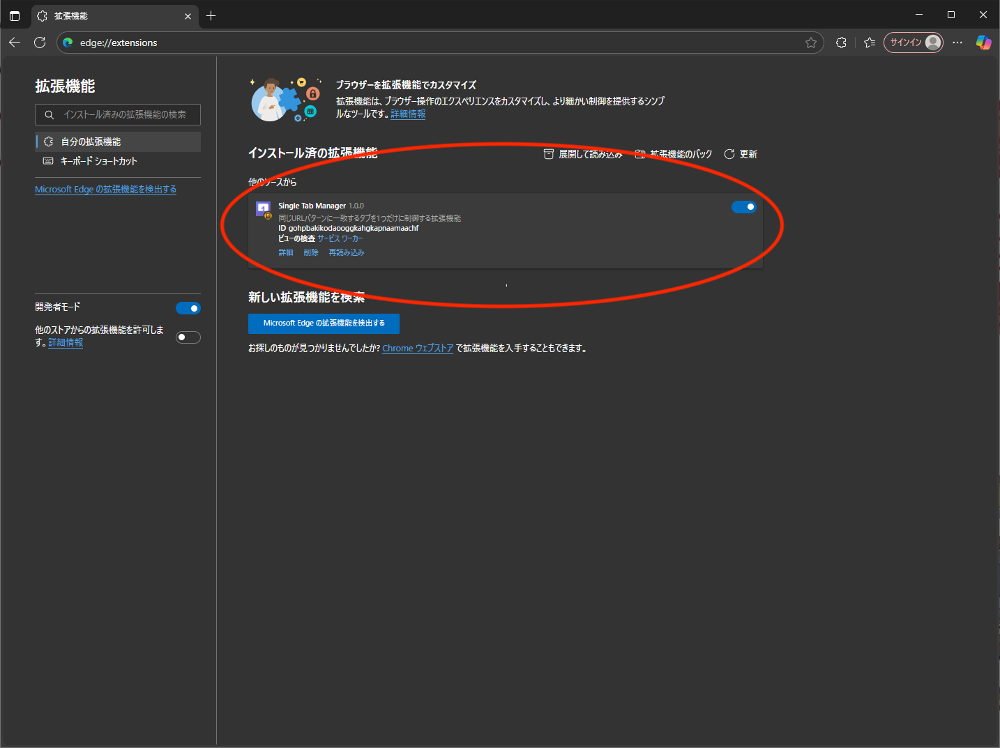

---

## 6. 詳細設定画面を開く

1. 「Single Tab Manager」の **詳細** ボタンをクリックします。
   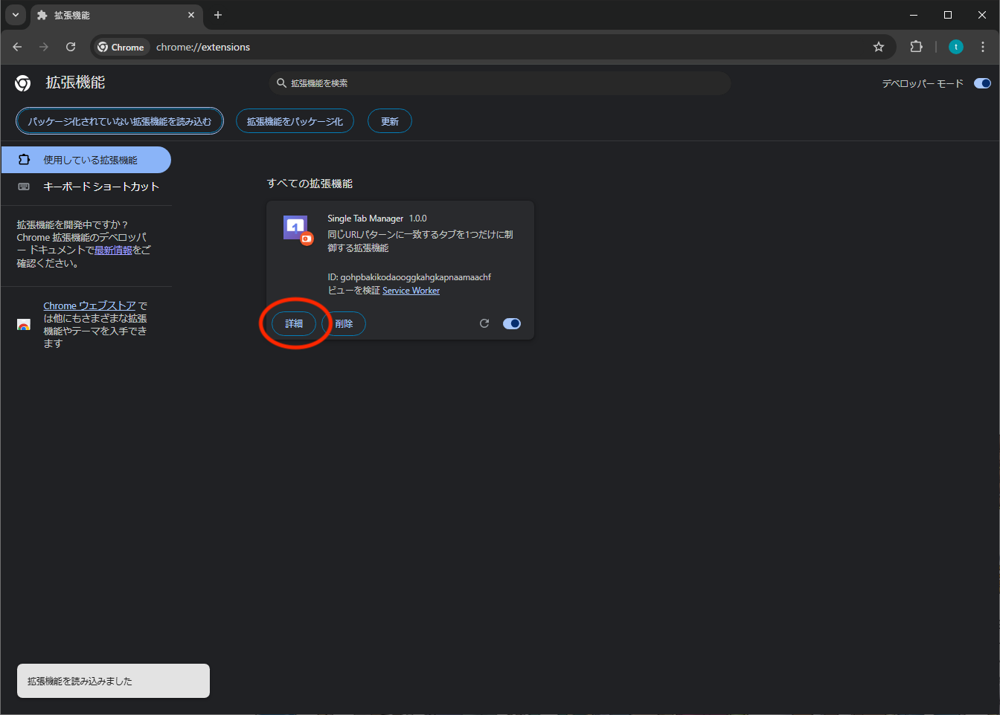
   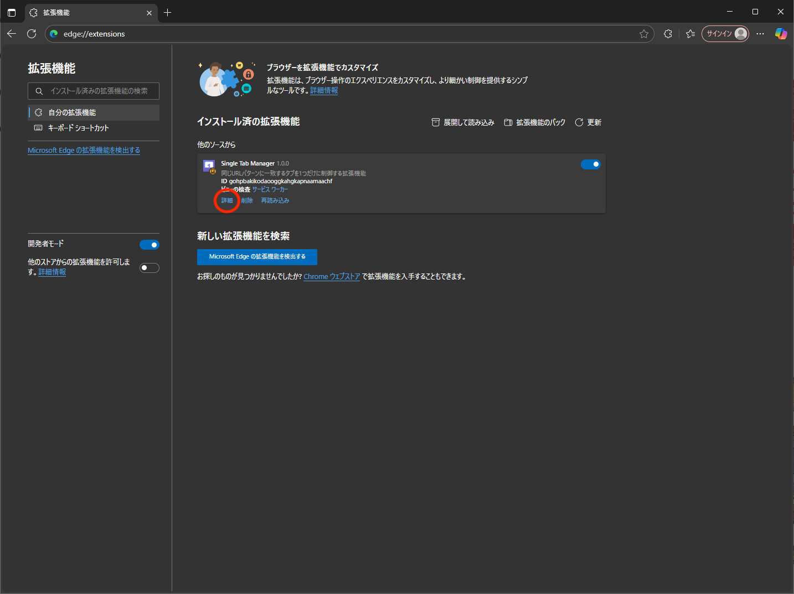
2. 「拡張機能のオプション」をクリックします。
   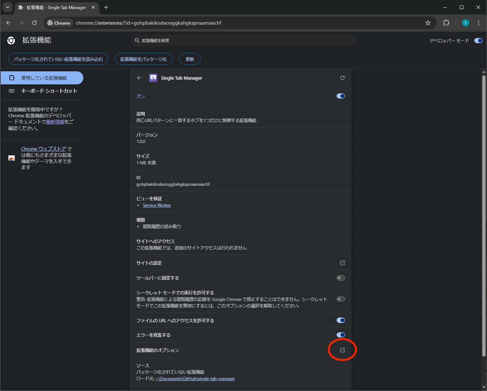
   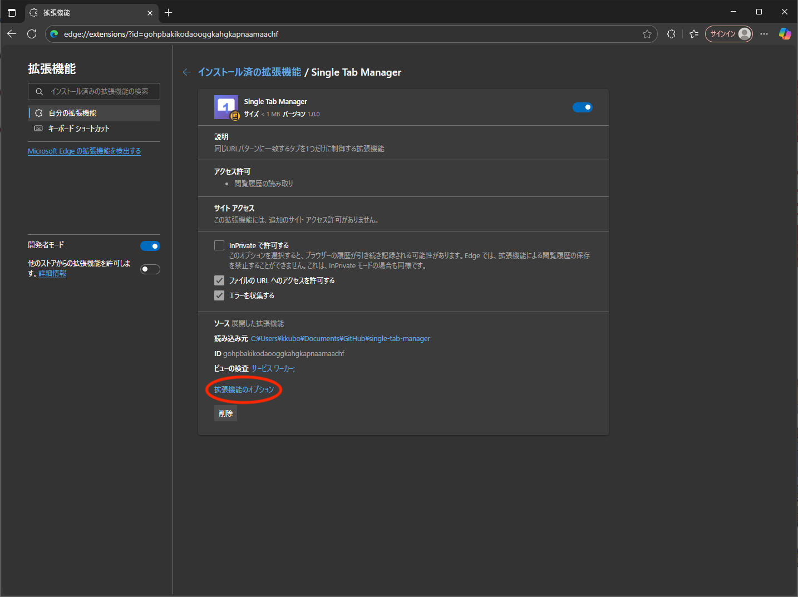

---

## 7. URL パターンを設定する

1. 設定画面が開いたら、「URL パターン（正規表現）」の入力欄に以下を入力します：
   ```
   http://192.168.100.197/DicomWeb/.*
   ```
2. **保存** ボタンをクリックします。

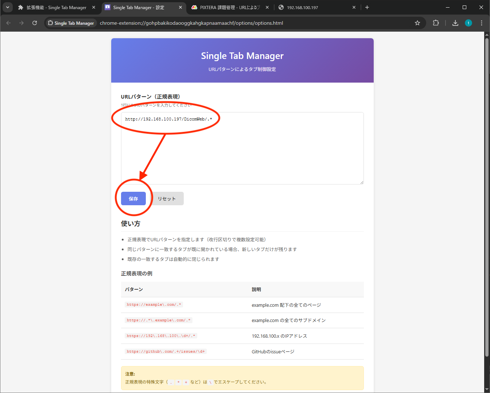

---

## 8. 設定の確認

- 画面に **「設定を保存しました」** と表示されれば完了です。
  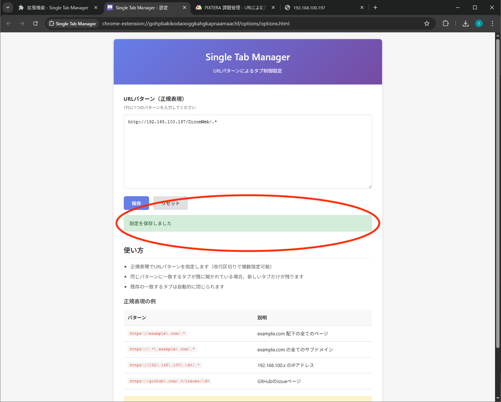

---

## 完了 🎉

これで「Single Tab Manager」が有効になり、指定した URL を複数開いた場合も常に最新の 1 タブだけが残るようになります。
